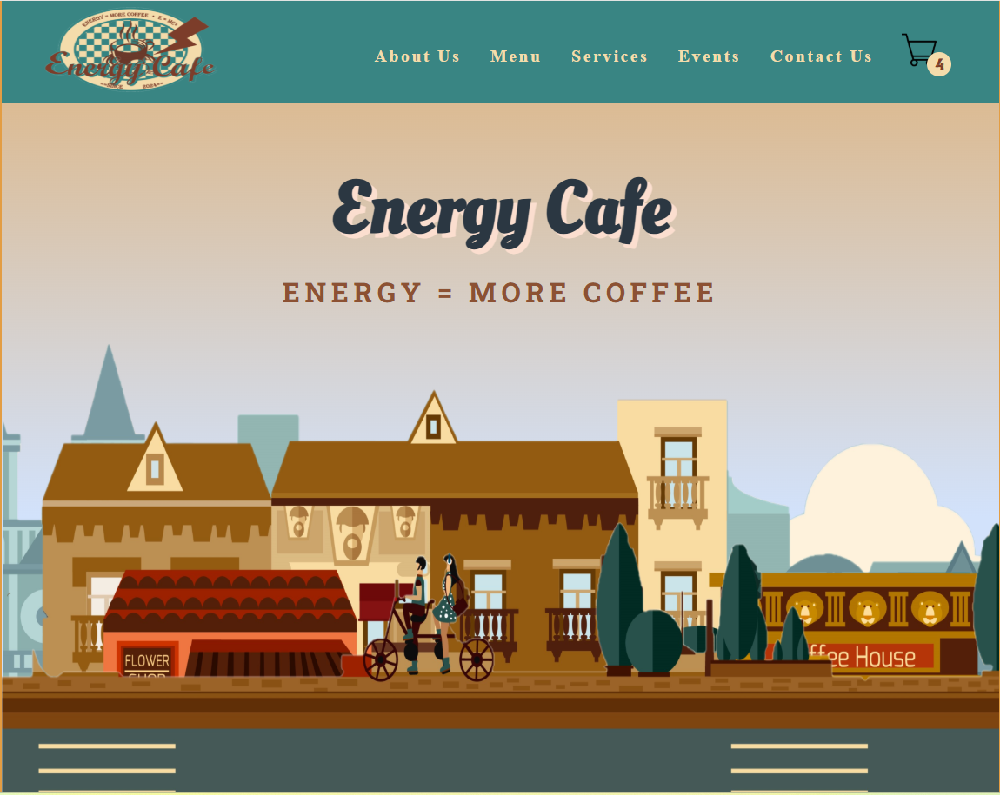
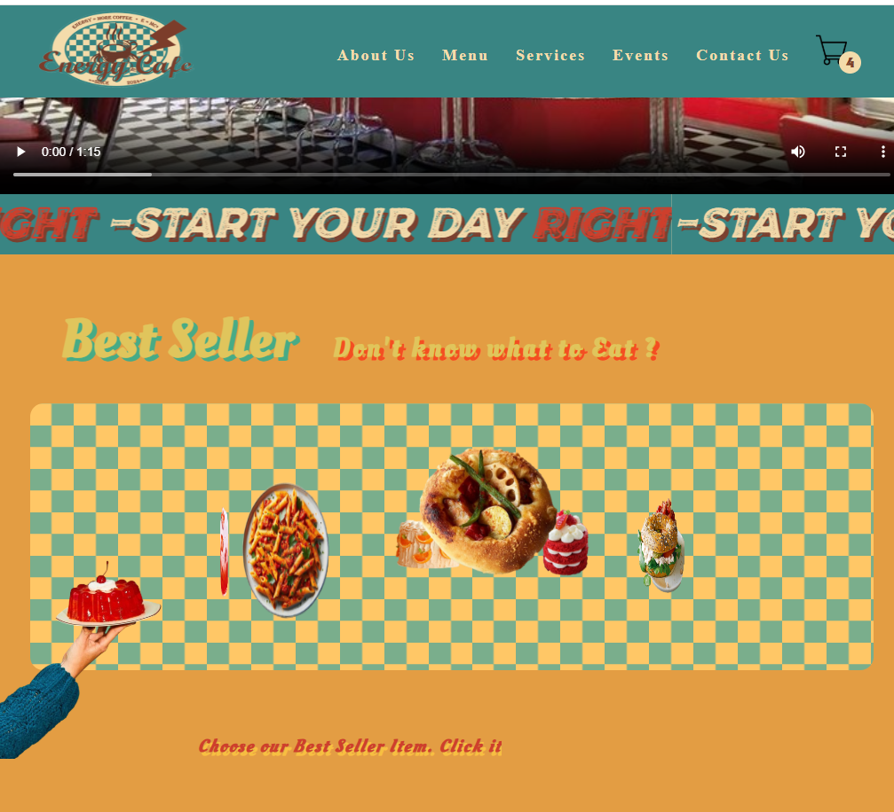
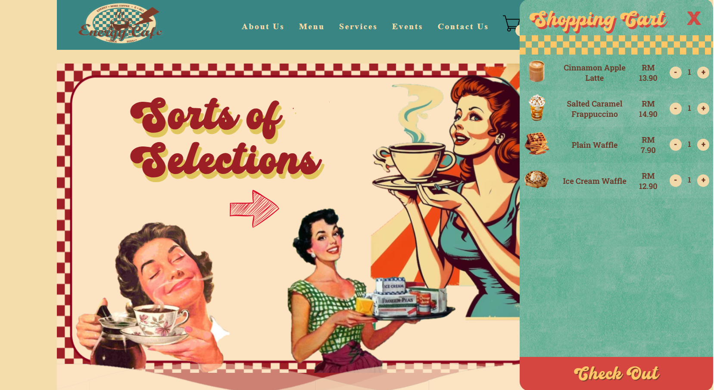
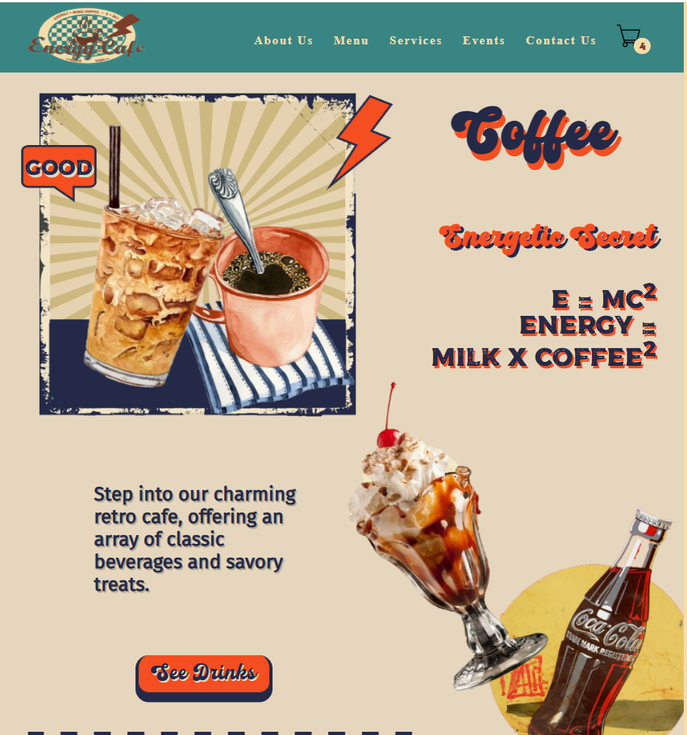
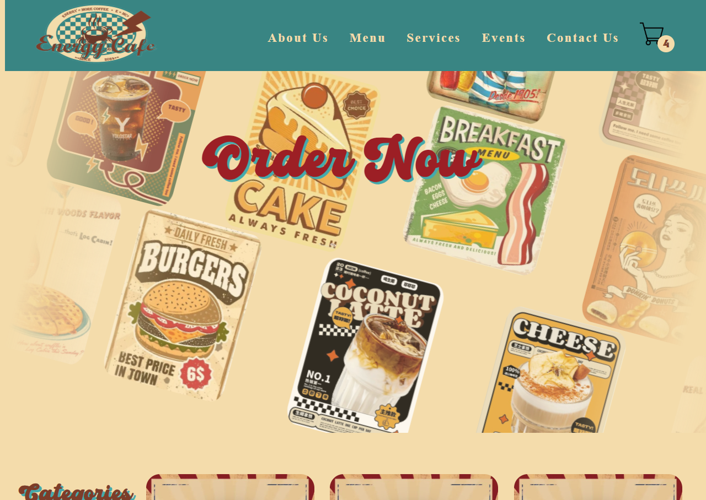
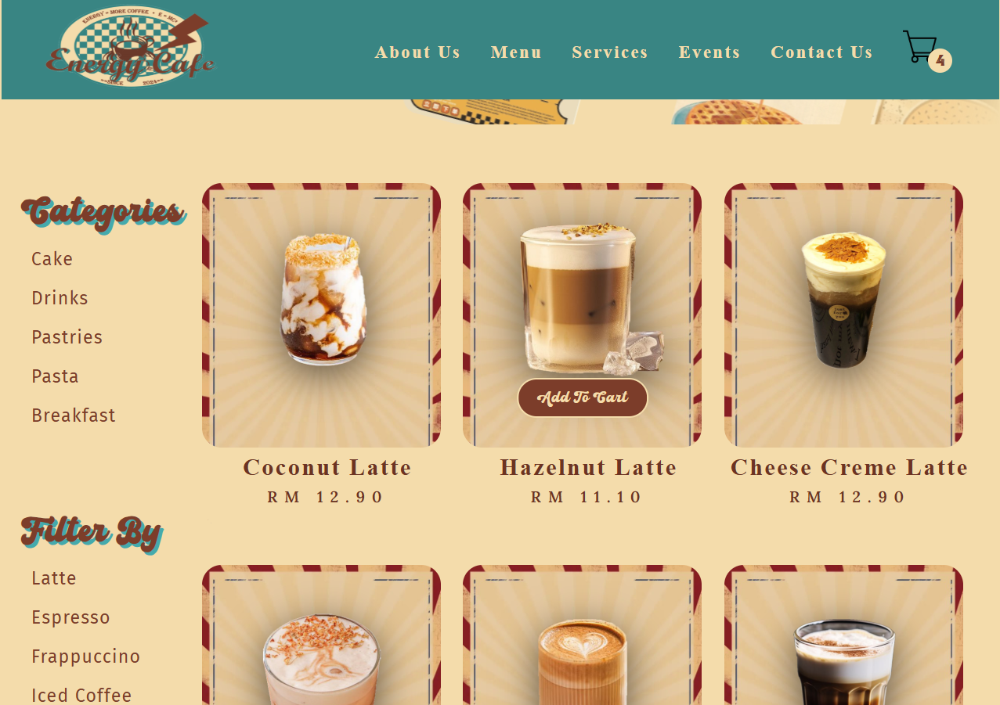
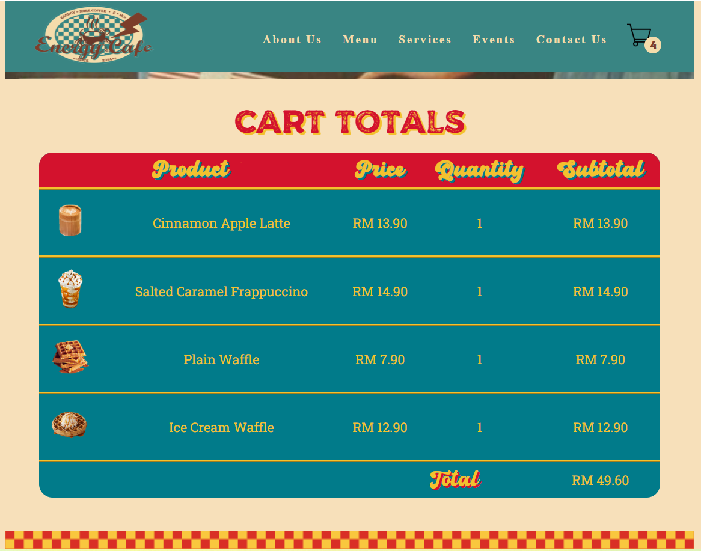

# ☕ Energy Cafe Website

## 📌 Overview
Energy Cafe Website is a web design and development project created as part of a Year 1 Semester 2 coursework. The project focuses on designing a modern and visually appealing cafe website that showcases menu items, pricing, and branding in a structured layout.

The website is inspired by a real-world cafe menu design, featuring multiple categories such as pastries, breakfast, drinks, desserts, and pasta.

---

## 🎯 Objectives
- Design a clean and user-friendly cafe website
- Practice HTML and CSS layout structuring
- Apply visual design principles (typography, spacing, color)
- Simulate a real-world restaurant menu interface

---

## ✨ Features

### 🧾 Menu Display
- Organized sections:
  - Pastries
  - Breakfast
  - Coffee
  - Drinks
  - Cake
  - Pasta
- Each item includes name and pricing
- Clear categorization for easy navigation

### 🎨 Visual Design
- Modern cafe-themed UI
- Consistent color palette
- Typography styling for headings and content
- Image integration for food and beverages

### 📱 Layout Design
- Structured layout similar to real restaurant menus
- Grid-based content organization
- Balanced spacing and alignment

### 📍 Business Information
- Cafe name: **Energy Cafe**
- Location: Suria KLCC, Kuala Lumpur
- Contact number and opening hours included

---

## 🏗️ Technologies Used
- **HTML5** – Structure of the webpage  
- **CSS3** – Styling and layout design  

---

## 🖼️ Project Preview

### Homepage

### Menu Page

### Payment Page

## ▶️ How to Run

1. Download or clone the repository  
2. Open the project folder  
3. Double click `index.html`  
   OR open with Live Server in VS Code  

---

## 📌 Key Design Highlights
- Multi-section menu layout similar to real cafe menus :contentReference[oaicite:1]{index=1}  
- Clear grouping of items improves user readability  
- Consistent typography enhances visual hierarchy  
- Use of images adds realism to the design  

---

## ⚠️ Limitations
- Static website (no backend functionality)  
- No online ordering system  
- No database integration  
- Not fully responsive (if not implemented)  

---

## 🚀 Future Improvements
- Add responsive design (mobile-friendly)
- Implement online ordering system
- Integrate backend (Node.js / PHP)
- Add shopping cart functionality
- Connect to database for dynamic menu updates

---

## 👤 Author
**Wong Jin Xuan**  
Bachelor of Data Science (Honours)  
Tunku Abdul Rahman University of Management and Technology (TARUMT)

---

## 📄 License
This project is for academic purposes only.